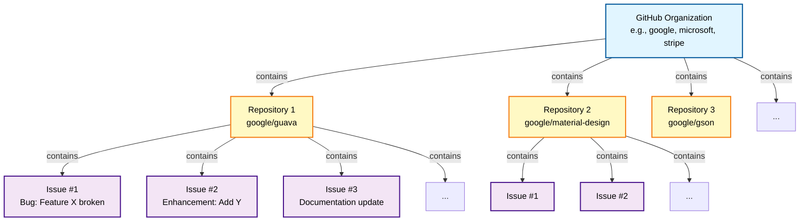

# Bucket Harvest

A streamlined toolkit for efficiently collecting and analyzing GitHub repository and issue data using parallel bucket processing strategies.

## Overview

Bucket Harvest provides two powerful workflows:

1. **Organization Analysis (`org_to_repos`)** - Analyze all repositories in a GitHub organization
2. **Issue Collection (`repo_to_issues`)** - Collect and analyze recent issues from specific repositories

Both workflows use intelligent bucketing and parallel processing to efficiently handle large datasets while respecting GitHub API rate limits.

## Architecture

### GitHub Data Hierarchy



### Bucket-Harvest Workflow

```mermaid
graph LR
    A[User Chooses<br/>Organization<br/>e.g., 'google'] -->|input| B[Bucket-Harvest<br/>org_to_repos]
    B -->|analyzes all repos<br/>ranks by activity| C[Output:<br/>Highest Activity Repos<br/>CSV Report]
    C -->|user reviews| D[User Chooses<br/>Repository<br/>e.g., 'google/guava']
    D -->|input| E[Bucket-Harvest<br/>repo_to_issues]
    E -->|collects most<br/>recent 100 issues| F[Output:<br/>100 Recent Issues<br/>Markdown Files]

    style A fill:#e8f5e9,stroke:#2e7d32,stroke-width:2px,color:#000
    style B fill:#fff9c4,stroke:#f57f17,stroke-width:2px,color:#000
    style C fill:#e3f2fd,stroke:#1565c0,stroke-width:2px,color:#000
    style D fill:#e8f5e9,stroke:#2e7d32,stroke-width:2px,color:#000
    style E fill:#fff9c4,stroke:#f57f17,stroke-width:2px,color:#000
    style F fill:#e3f2fd,stroke:#1565c0,stroke-width:2px,color:#000
```



**Key Points:**
- **Green boxes**: User decisions (you choose the org and repo)
- **Yellow boxes**: Bucket-Harvest automation (tool finds and collects data)
- **Blue boxes**: Outputs (data delivered to you for analysis)

## Quick Start

### Prerequisites

1. **Python 3.7+** with dependencies:
   ```bash
   pip install -r requirements.txt
   ```

2. **GitHub Token** - Create `.env` file with your token:
   ```bash
   cp .env.template .env
   # Edit .env and add your token
   ```

3. **GitHub CLI** (for issue collection):
   ```bash
   gh auth login
   ```

### Workflow 1: Organization Repository Analysis

Analyze all active repositories in any GitHub organization:

```bash
# Step 1: Create buckets of active repositories
python scripts/bucket_harvest/org_to_repos/create_org_buckets.py <org_name>

# Step 2: Process buckets in parallel to collect detailed metrics
python scripts/bucket_harvest/org_to_repos/process_org_buckets.py <org_name>
```

**Examples:**
```bash
# Analyze Google's repositories
python scripts/bucket_harvest/org_to_repos/create_org_buckets.py google
python scripts/bucket_harvest/org_to_repos/process_org_buckets.py google

# Analyze Stripe with custom settings
python scripts/bucket_harvest/org_to_repos/create_org_buckets.py stripe --buckets 5 --days 14
python scripts/bucket_harvest/org_to_repos/process_org_buckets.py stripe --workers 3
```

**Output:** `scripts/bucket_harvest/org_to_repos/data/<org>/.{org}_analysis.csv`

### Workflow 2: Repository Issue Collection

Collect the 100 most recent issues from any repository:

```bash
# Single command to collect issues
python scripts/bucket_harvest/repo_to_issues/collect_recent_issues.py <owner/repo>

# Or use the convenient wrapper
python bucket-harvest.py <owner/repo>
```

**Examples:**
```bash
# Collect issues from React
python bucket-harvest.py facebook/react

# Collect issues from TypeScript
python bucket-harvest.py microsoft/typescript

# Analyze collected issues
python scripts/bucket_harvest/parallel_issue_analyzer.py facebook/react
```

**Output:** `scripts/bucket_harvest/repo_to_issues/data/<owner_repo>/.<repo>/`

## Workflows in Detail

### Organization Analysis

**Purpose:** Get comprehensive metrics on all active repositories in an organization

**Metrics Collected:**
- Stars, forks, contributors
- Commits and PRs in last 30 days
- Primary language
- Repository health score
- Description and metadata

**Use Cases:**
- Competitive analysis
- Technology stack research
- Open source ecosystem mapping
- Identifying active projects

**Command Options:**
```bash
# create_org_buckets.py
--buckets N    # Number of buckets (default: 10)
--days N       # Activity window in days (default: 30)

# process_org_buckets.py
--workers N    # Parallel workers (default: 5)
```

### Issue Collection & Analysis

**Purpose:** Collect and analyze the most recent issues from a repository

**What's Collected:**
- Issue title, description, labels
- Author and creation date
- Full comment threads
- Issue state and metadata

**Use Cases:**
- Finding contribution opportunities
- Understanding project pain points
- Community sentiment analysis
- Bug bounty research

**Features:**
- Parallel processing (10 threads)
- Markdown output for easy analysis
- Excludes pull requests
- Handles rate limiting automatically

## Directory Structure

```
bucket-harvest/
├── bucket-harvest.py              # Convenient wrapper script
├── bucket-harvest.bat             # Windows batch wrapper
├── .env.template                  # Environment template
├── requirements.txt               # Python dependencies
├── README.md                      # This file
└── scripts/
    └── bucket_harvest/
        ├── parallel_issue_analyzer.py  # AI-powered issue analysis
        ├── agents/                     # Agent prompt templates
        ├── utils/                      # Shared utilities
        ├── org_to_repos/              # Organization analysis
        │   ├── create_org_buckets.py
        │   ├── process_org_buckets.py
        │   ├── README.md
        │   └── data/                  # Output directory
        └── repo_to_issues/            # Issue collection
            ├── collect_recent_issues.py
            ├── create_issue_buckets.py
            ├── generate_bucket_scripts.py
            ├── BUCKET_strategy.md
            ├── README.md
            └── data/                  # Output directory
```

## Output Formats

### Organization Analysis Output

CSV file (`.{org}_analysis.csv`) with columns:
- `repo` - Repository name
- `star_count` - GitHub stars
- `contributor_count` - Number of contributors
- `github_url` - Repository URL
- `primary_language` - Main programming language
- `description` - Repository description
- `commits_last_30d` - Recent commits
- `closed_pr_last_30d` - Recent closed PRs
- `repo_health_score` - Calculated health metric

**Health Score Formula:** `(commits_last_30d + closed_pr_last_30d) / 2`

### Issue Collection Output

Individual markdown files per issue:
```markdown
# Issue #1234: Fix authentication bug

**GitHub URL:** https://github.com/owner/repo/issues/1234
**Created:** 2025-01-15
**Author:** username
**State:** open
**Labels:** bug; authentication

---

## Issue Description
[Full issue description]

---

## Comments
[All comments with authors and dates]
```

## Advanced Usage

### Customizing Organization Analysis

```bash
# Large organization with many repositories
python create_org_buckets.py microsoft --buckets 20 --days 60
python process_org_buckets.py microsoft --workers 10

# Small/focused organization
python create_org_buckets.py stripe --buckets 3 --days 14
python process_org_buckets.py stripe --workers 2
```

### Issue Analysis Pipeline

```bash
# Step 1: Collect issues
python bucket-harvest.py shopify/cli

# Step 2: Define selection criteria
# Edit user/selection-criteria.md with your criteria

# Step 3: Analyze with AI
python scripts/bucket_harvest/parallel_issue_analyzer.py shopify/cli

# Results saved to .notes/issue-analysis-shopify_cli-{timestamp}.md
```

### Using with Claude Code

This toolkit is designed to work seamlessly with Claude Code:

1. User asks: "Analyze Google's GitHub repositories"
2. Claude runs the organization analysis workflow
3. Claude reads the output CSV and provides insights
4. Claude can drill down into specific repositories

## Performance

**Organization Analysis:**
- ~150 repositories: 5-8 minutes
- ~80 repositories: 3-5 minutes
- Parallel processing with configurable workers
- Built-in rate limit handling

**Issue Collection:**
- 100 issues: 1-2 minutes (parallel)
- 100 issues: 5-8 minutes (sequential)
- 4-6x speedup with parallel processing

## Error Handling

Both workflows include robust error handling:

- Automatic retry with exponential backoff
- Rate limit detection and waiting
- Graceful handling of deleted/private repositories
- Partial results on failure
- Clear error messages

## Troubleshooting

### "API_GITHUB_TOKEN not found"
Create a `.env` file with your GitHub token:
```bash
API_GITHUB_TOKEN=your_token_here
```

### "Organization not found (404)"
- Check organization name spelling
- Ensure organization is public
- Use lowercase: `google` not `Google`

### "Rate limit exceeded"
- Wait for rate limit reset (shown in error)
- Reduce number of workers: `--workers 2`
- Check authentication: `gh auth status`

### "gh: command not found"
Install GitHub CLI: https://cli.github.com/

## Best Practices

1. **Start Small** - Test with small organizations/repos first
2. **Monitor Rate Limits** - Use fewer workers if hitting limits
3. **Save Outputs** - Results are cached in `data/` directories
4. **Use Exclusions** - Add unwanted issues to `user/exclusions.txt`
5. **Document Criteria** - Update `user/selection-criteria.md` for analysis

## Supported Platforms

- Windows (native and WSL)
- macOS
- Linux

No bash-specific features required - pure Python implementation.

## Contributing

This toolkit follows these principles:
- Generic and reusable (works with any org/repo)
- Respects GitHub API guidelines
- Clean, documented code
- Defensive use only (analysis, not exploitation)

## License

MIT

## Support

For issues or questions:
1. Check workflow-specific READMEs in subdirectories
2. Review error messages carefully
3. Verify authentication and permissions
4. Test with smaller datasets first

---

*Part of the GitHub Detective toolkit for bounty hunting and open source research*
